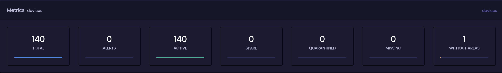
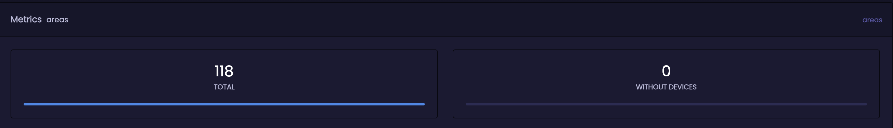
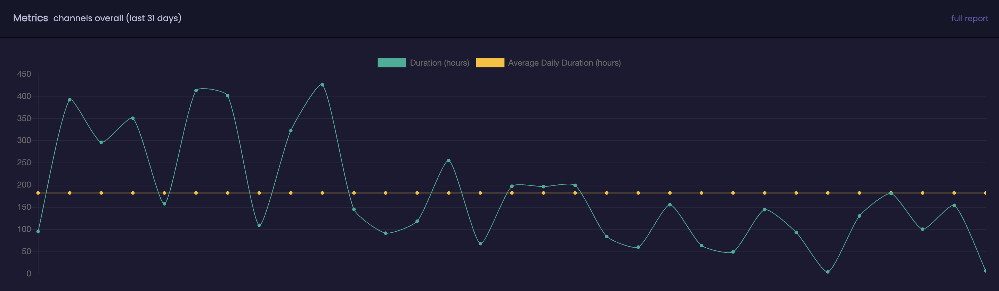

## Overview
Glyde is the web management interface for The ROOMNET Apple TV solution.
The interface provides configuration and management options for Apple TVs, areas and the balcony App.
It also provides metrics for TV channel usage for properties using the ROOMNET TV Application.

### Access
Access Glyde at [glyde.roomnet.com](https://glyde.roomnet.com)
A login is required and can be requested via your project manager or support. On first login you will be prompted to setup multi-factor-authentication

### Site Selector
If your login has access to multiple properties you will be presented with the site selector. Choose the required property. The site selector can be accessed again by clicking the :material-sitemap-outline: icon at the top of the page. 

### Settings/Time Zone
Clicking the :material-cog: icon in the top right will allow you to change how times are shown throughout the glyde interface. The default behaviour will use the timezone of the device you are using. Selecting `Use Site's Timezone` will change this behaviour to show any date and time based on the time zone of the property.  
This can be helpful when working across multiple properties especially if they are not in your location.

### Dashboard
On Login the dashboard is displayed. Overview data is displayed for devices, areas, effusion server and PMS events.

#### Devices

Reported status of devices is shown here.

- Total - All devices registered to this Property.
- Alerts - Number of devices that are not communicating with Glyde.
- Active - Number of actively communicating devices.
- Spare - Number of devices marked as spare.
- Quarantined - Number of devices marked with this status. This is typically used for devices that are under investigation.
- Missing - Number of devices marked as missing. Typically used for devices that cannot be located.
- Without Areas - Devices that have not been assigned to an area. If there are any devices without area this should be resolved quickly.

#### Alert Metrics

Provides a 30 day history of device alerts. Can be helpful in monitoring the overall reliability of network connectivity and troubleshooting.

#### Areas

Total areas configured and any that do not have devices assigned to them.
!!! info
    An Area is a container for devices. This is commonly a guest room, but could something like a gym or a public space.

#### Effusion metrics

Reports the status of the MacMini(s) installed in the network. These MacMinis provide a local copy of assets and applications, ensuring the guest experience is as smooth as possible. 
In normal operation each section should display a green tick.

#### PMS

The PMS interface is important in making sure all guest data is removed at the end of their stay. If there is any outage or odd behaviour devices may be reset too often or not at all. 
The line graph can be interacted with showing the number of events over the last 30 days. The section on the right gives a snapshot of the last events received and the times they occurred.

## Core 

### Devices
All devices assigned to the property can be viewed and managed from this section.
An overview of all devices is provided. 
Any devices with an Orange warning triangle are not communicating with Glyde and require attention.  

Clicking on any of the cetegories along the top of the page will flitler the device list.

Clicking on a device will reveal the details page

This section provides detailed information and status details for a single device. There are also aspects of the device that can be configured.

- Cleardown - This will perform a complete wipe and rebuild of the device. All guest data will be removed including logins.
- Reset - A simple restart of the device.
- Delete - This will completely delete the device from glyde and your property. This is only available to site admins and should only be used under guidance from a ROOMNET team member.

#### Device Settings

- Device Name - Sets the name of the device. This is the name displayed in the system and the name guests will see if they want to use Airplay. Typically this would be the room number. In cases whjere there are multiple devices in a room, please name the deive so it can be identified clearly, for example `Room 101 Bedroom`

#### Associated Areas

Allows association of devices and areas. A devcie can be part of multiple areas, they may be useful if a room can be sold in different configurations.
It is important this is set accuratley as PMS events are area based so setting the wrong value here will result in the AppleTV not resetting on checkout or restting when a different room checks out.

#### History
Helpful for Troubleshooting, displays the most recent events that have been sent to this device.

### Areas

Areas are used to group devices. Whilst typically a guest room, an area can be any logical grouoing of one or more devices. This could be a public space, meeting room, gym etc...

- Name is a recognisable value for each Area that can be set to any area required.  
- Identifier is used to match the events your PMS sends us to areas. This must match the room values in the PMS.

Clicking on an area will take you to its details page.

- Cleardown: This will perform a complete wipe and rebuild of all devcies assigned to this area.
- Restart: Triggers a restart of all devcies assigned to the room.
- Delete: This will completely delete the area from glyde and your property. This is only available to site admins and should only be used under guidance from a ROOMNET team member. This does not remove any devices associated to the area, but they will no longer respon to check out events for th area that has been removed and will need to be assigned to a new area.

#### Area Settings

Identifier and name can be changed here. Notes can be added as required.

#### Associated Devices

Allows assignment of any enrolled device to teh selected area. Multiple devcies can be assigned to each area.

### Activate

Used as part of the device [onboarding process](../setup/onboarding.md)

### Settings

This section is only editable by ROOMNET staff and for reference only. 

### Tasks

Recurring tasks are defined in this section,
As with Settings This section is only editable by ROOMNET staff.

## TV APP

The ROOMNET TV application provides live TV streams, typically using local Terrestrial and/or satellite feeds. This guide is only relevant to the ROOMNET Live TV app.

### TV Metrics

Metrics data is only available when the ROOMNET TV application is used.
Metrics are collected anonymously and displayed as an overall for the property. The data displayed covers the last 30 days.

The data provided can be used to establish when TV channels are being watched and if there are any channels that are not being used. 
Channels that are not being used could be removed / replaced, making better usage of your hardware or subscriptions.

Overall viewing time is displayed at the top of the page. The green line shows collective hours viewed per day, the yellow an average viewing time based on the last 30 days. 

Below the overall graph, several view are provided showing most and least used channels, usage by day and usage by hour of the day.

Each graph has a full report button. Clicking this will display a full list of channels available at the property and collective hours viewed over the last 30 days.

## Balcony App

The Balcony section provides configuration for the Balcony App. This is covered in the [balcony](balcony.md) section
